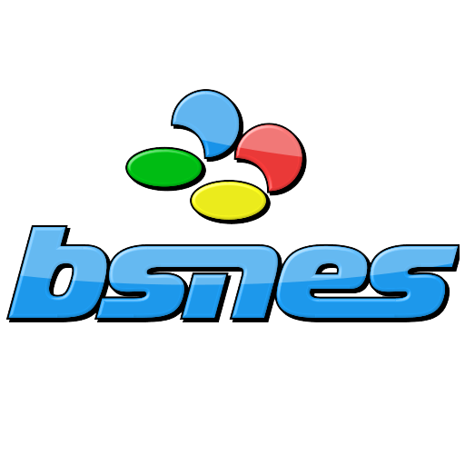

# Nintendo - SNES / SFC (bsnes)

### Description

bsnes is a multi-platform Super Nintendo (Super Famicom) emulator from Near / Byuu that focuses on performance, features, and ease of use.

### License

GPLv3

### Icon

### Fanart

Help make me fanart!

### Screenshots

### Disclaimer

*In loving memory of Near / Byuu*
